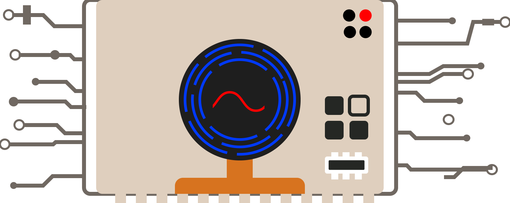
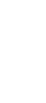

# CyberDefender

An OO-focused [Java](https://www.java.com/en/) with [libGDX](https://libgdx.com/)-written Tower-Defense game generated with [gdx-liftoff](https://github.com/libgdx/gdx-liftoff).

This project was generated with a template including simple application launchers and an `ApplicationAdapter` extension that draws libGDX logo.

## Usage
After downloading [Java](https://www.java.com/en/download/), and unzipping the project-folder, either run the game by opening as a project in an IDE and press run, or in a terminal, write:

` .\gradlew lwjgl3:run `

To build from a source section, write:

` .\gradlew build`

## How To Play
In  CyberDefender you are protecting a computer's core from various robotic viruses.

The gameplay inputs are purely by mouse, as you press certain buttons to build/upgrade towers, and to control the pace of the game.

To prepare before the game starts, locate the bar of towers on the right side of the screen.

Then, place one alongside the path so that its white circle reaches the path. This action can be repeated. Below is an example of a good first placement.

Now, with your tower/towers ready, press the play button in the bottom left corner.

Enemies will start to appear from the left side of the screen.

Your towers will shoot at them, to defend your core. If too many enemies reach your core to bring your health 0, it's Game Over!

If you at any time want to speed up the game, the play button should be replaced with a speed-up button during the wave.

You may also pause the game whenever you want, by pressing the pause button in the right, near the bottom of the tower menu.

If you beat a wave, you will gain a money bonus alongside the money you got from killing enemies, and can build more towers.
From here, repeat until the enemies take down your core! You can always see your health and money on screen, updating as you play.

Try and go for as long as you can!

## Platforms / Project Structure

- `core`: Main module with the application logic shared by all platforms.
- `lwjgl3`: Primary desktop platform using LWJGL3; was called 'desktop' in older docs.
- `assets`: All game textures, sounds and maps.

## Gradle

This project uses [Gradle](https://gradle.org/) to manage dependencies.
The Gradle wrapper was included, so you can run Gradle tasks using `gradlew.bat` or `./gradlew` commands.
Useful Gradle tasks and flags:

- `--continue`: when using this flag, errors will not stop the tasks from running.
- `--daemon`: thanks to this flag, Gradle daemon will be used to run chosen tasks.
- `--offline`: when using this flag, cached dependency archives will be used.
- `--refresh-dependencies`: this flag forces validation of all dependencies. Useful for snapshot versions.
- `build`: builds sources and archives of every project.
- `cleanEclipse`: removes Eclipse project data.
- `cleanIdea`: removes IntelliJ project data.
- `clean`: removes `build` folders, which store compiled classes and built archives.
- `eclipse`: generates Eclipse project data.
- `idea`: generates IntelliJ project data.
- `lwjgl3:jar`: builds application's runnable jar, which can be found at `lwjgl3/build/libs`.
- `lwjgl3:run`: starts the application.
- `test`: runs unit tests (if any).

Note that most tasks that are not specific to a single project can be run with `name:` prefix, where the `name` should be replaced with the ID of a specific project.
For example, `core:clean` removes `build` folder only from the `core` project.

## Contribution
Pull requests are welcome. For major changes, please open an issue first to discuss what you would like to change.

Ensure to update tests as appropriate.
