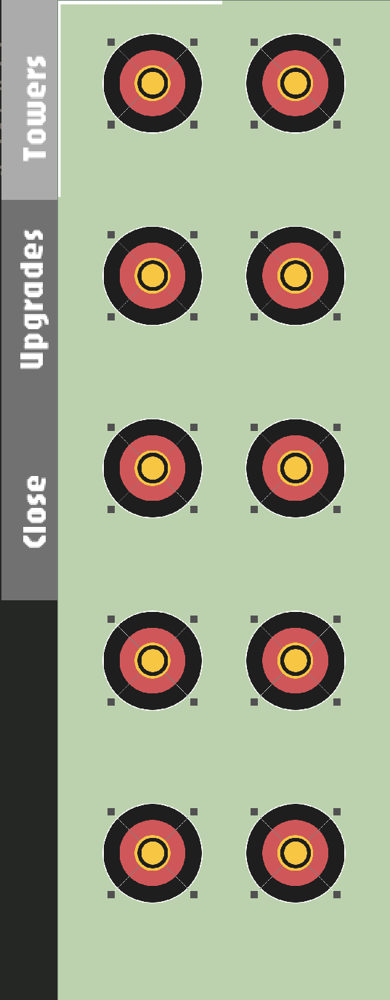
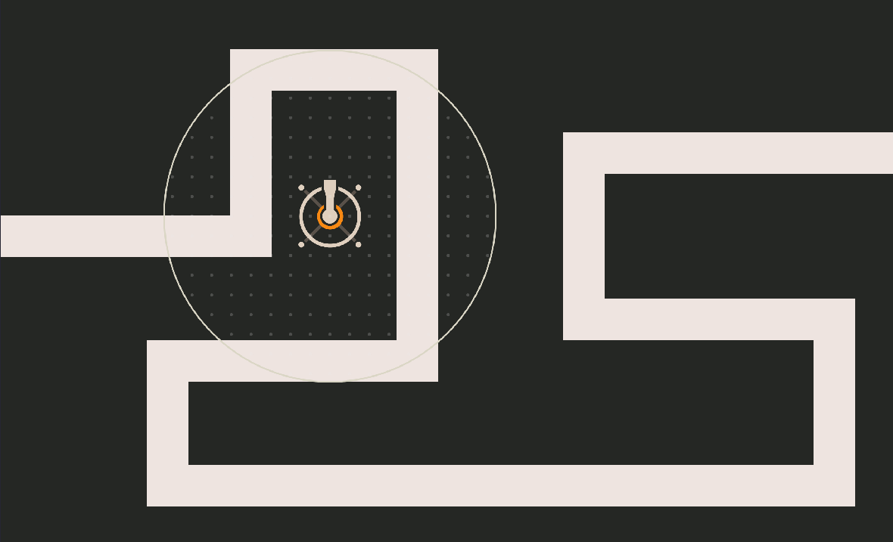
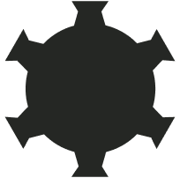
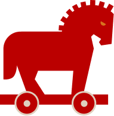
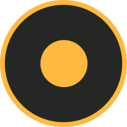
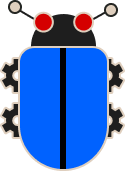
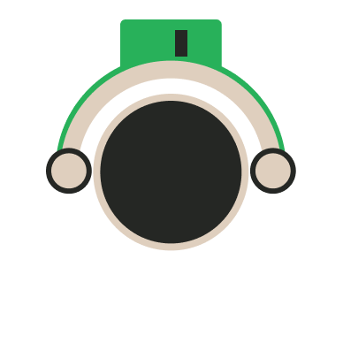
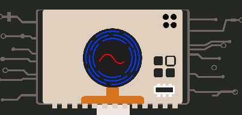

## How To Play
In  CyberDefender you are protecting a computer's core from various robotic viruses.

The gameplay inputs are purely by mouse, as you press certain buttons to build/upgrade towers, and to control the pace of the game.

To prepare before the game starts, locate the bar of towers in the top right corner of the screen.

Then, place one alongside the path so that its white circle reaches the path. This action can be repeated. Below is an example of a good first tower and placement.

Pick the leftmost tower from the menu, and place it.

If you press your placed tower, you will also be shown its individual updgrade menu. Here, you can spend currency to make the tower more powerful.

Here, you can also sell your tower, or change what way it should target enemies.

Now, with your tower/towers ready, press the play button in the bottom left corner.

Enemies will start to appear from the left side of the screen.

This is a visual of the most common enemy type. They are most easily dealt with by the basic tower placed earlier.

This is a fast enemy. They are dealt with by the pulsating tower, that catches them before they get out of range.

This is how the pulsating tower looks like.

This is a tanky enemy. They are dealt with by the missile tower, which prospers at dealing constant damage to slow targets.

Your towers will shoot at the enemies, to defend your core. If too many enemies reach your core to bring your health 0, it's Game Over!

If you at any time want to speed up the game, the play button should be replaced with a speed-up button during the wave.

You may also pause the game whenever you want, by pressing the pause button in the right, near the bottom of the tower menu.

If you beat a wave, you will gain a money bonus alongside the money you got from killing enemies, and can build more towers.
From here, repeat until the enemies take down your core! You can always see your health and money on screen, updating as you play.

Try and go for as long as you can!
